# Cherry Leaf Mildew Detection App


## Table of Contents
1. [Overview](#overview)
2. [Dataset Content](#dataset-content)
3. [Business Requirements](#business-requirements)
4. [Hypotheses and Validation](#hypotheses-and-validation)
    - [Hypothesis 1 – Texture Variability](#hypothesis-1---texture-variability)
    - [Hypothesis 2 – Input Resolution Efficiency](#hypothesis-2---input-resolution-efficiency)
    - [Hypothesis 3 – Data Augmentation for Generalization](#hypothesis-3---data-augmentation-for-generalization)
    - [Hypothesis Summary](#hypothesis-summary)
5. [Rationale - Mapping Business Requirements to ML Tasks](#rationale---mapping-business-requirements-to-ml-tasks)
6. [Machine Learning Business Case](#machine-learning-business-case)
    - [Model Development & Iterations](#model-development--iterations)
7. [Dashboard Design](#dashboard-design)
8. [Deployment](#deployment)
9. [Technologies & Libraries](#technologies--libraries)
10. [Testing](#testing)
11. [Unfixed Bugs](#unfixed-bugs)
12. [Known Limitations](#known-limitations)
13. [Future Work](#future-work)
14. [Local Setup Instructions](#local-setup-instructions)
14. [Credits](#credits)


---

# Overview
The app could not be hosted on Heroku due to performance issues and is therefore hosted on render.com.
The app is accessible [here](https://milestone-project-5.onrender.com)

The project develops a machine-learning-based system capable of distinguishing healthy cherry leaves from those infected with powdery mildew using image analysis.
The accompanying Streamlit application provides visual exploration, hypothesis validation, and real-time leaf classification.

---

# Dataset Content

The project relies on a curated dataset of **4,208 high-resolution images** of cherry leaves, divided into two essential classification categories:

- **Healthy leaves**
- **Leaves infected with powdery mildew**

The dataset is sourced from [Kaggle](https://www.kaggle.com/codeinstitute/cherry-leaves).
These images simulate the type of leaf photographs Farmy & Foods agronomists routinely collect during field inspections. 

All images are RGB and originally sized at 256×256 pixels. For model experiments, they are resized to **100×100** or **50×50** pixels depending on the version under evaluation.
The images reflects a range of natural lighting conditions, leaf orientations, and background environments to mimic real-world orchard conditions.
Powdery mildew symptoms vary in intensity and appearance depending on humidity, sunlight exposure, and leaf age, making this diversity essential for building a robust detection model.

---

# Business Requirements

The client, *Farmy & Foods*, faces the challenge that their cherry plantations are increasingly affected by powdery mildew, a fungal disease. The current manual inspection process takes approximately 30 minutes per tree and is not scalable for thousands of trees across multiple farms, leading to inconsistencies and costly delays.

Machine Learning offers a way to detect mildew instantly from leaf images, enabling automated disease control and efficiency improvements.

| ID | Business Requirement | Description | Expected Business Value |
|----|----------------------|--------------|--------------------------|
| **BR1** | Visual Study | Conduct a visual analysis to differentiate healthy and mildew-infected leaves. | Build domain understanding and training materials for agronomists. |
| **BR2** | Prediction | Develop an AI model that predicts mildew presence from new leaf images. | Automate detection; reduce manual inspection time by 90%. |

Success Metric: ≥97% accuracy on the test dataset, ensuring decision reliability for field use.

---

# Hypotheses and Validation

To determine whether powdery mildew could be detected reliably through machine‑learning‑based image analysis, three hypotheses were formulated in close collaboration with Farmy & Foods agronomy specialists.  
Each hypothesis investigates a different dimension of model feasibility: visual separability, computational efficiency, and generalization capacity.

The validation process combined exploratory visualisation, texture analysis, statistical hypothesis testing, and controlled model experiments.  
This section presents each hypothesis with full context, methodology, visual evidence, interpretation, and business implications.

---

## Hypothesis 1 - Texture Variability

**Statement:**  
Mildew‑infected cherry leaves exhibit higher texture variability than healthy leaves, and these structural differences can be quantified through image‑based texture analysis.

### Context & Rationale

During routine orchard inspections, agronomists observed that infected leaves often appear duller and less uniform, exhibiting fine powder‑like patterns.  
These irregularities suggested that mildew affects the micro‑texture of the leaf surface.

Confirming this hypothesis was essential for two reasons:

1. **Scientific relevance:**  
   If texture variation is measurable, automated detection becomes more feasible.

2. **Business relevance:**  
   Texture‑based differentiation could support early diagnosis, even when colour differences are subtle.

### Methodology

To test the hypothesis:

1. Class‑average images were generated to highlight broad differences.  
2. Pixel‑level variability maps were computed to capture localised structural irregularities.  
3. GLCM texture features (contrast, homogeneity, energy, correlation) were extracted.  
4. The Mann–Whitney U test assessed whether differences between classes were statistically significant.

### Visual Evidence & Observations


*Figure 1. Average class images showing smoother gradients for healthy leaves and irregular brightness patterns for mildew‑infected leaves.*

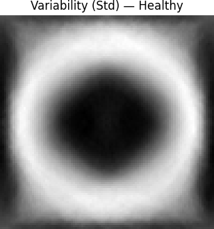


*Figure 2. Pixel variability maps indicate higher structural variance in infected samples.*

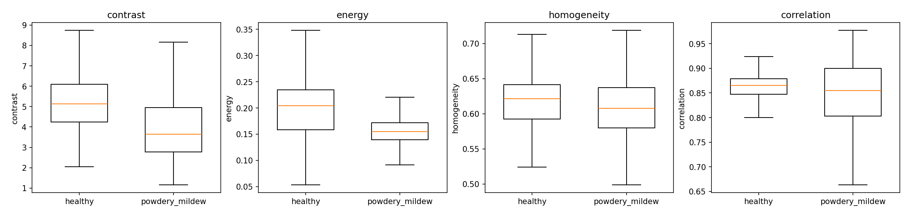

*Figure 3. GLCM feature distributions reveal significant differences for all four metrics (p < 0.001).*

### Interpretation

The results clearly confirm that mildew infection disrupts leaf texture in a measurable way.  
Higher contrast and variability indicate irregular fungal growth patterns, while lower homogeneity reflects loss of surface smoothness.

These quantified differences validate the hypothesis and demonstrate that texture variability is a reliable indicator for downstream classification.

### Business Impact

Validated texture features create an objective foundation for:

- training agronomists to recognise early symptoms,  
- developing interpretable machine‑learning models,  
- supporting consistent field inspections across regions.

This reduces dependency on subjective judgment and strengthens early‑stage detection workflows.

---

## Hypothesis 2 - Input Resolution Efficiency

**Statement:**  
Reducing the input image resolution from 100×100 pixels to 50×50 pixels does not meaningfully reduce classification accuracy.

---

### Context & Rationale

For Farmy & Foods, any practical machine‑learning solution must operate efficiently on a range of devices.  
While the Streamlit dashboard runs on Render, long‑term deployment plans include:

- handheld mobile devices used by agronomists,  
- tablets mounted on tractors or utility vehicles,  
- drone‑based early‑warning imaging systems.

Lower-resolution images reduce computational load, speed up inference, and lower bandwidth—critical for field‑level use.  
However, resolution reduction must not come at the cost of diagnostic accuracy.

Thus, Hypothesis 2 tests whether a smaller input resolution still retains the essential visual features required for reliable mildew classification.

---

### Methodology

Two models were trained and compared under strictly controlled conditions:

1. **Model v1:** Input size 100x100  
2. **Model v2:** Input size 50x50  

Both shared identical:

- architecture,  
- training duration,  
- learning hyperparameters,  
- train/validation/test splits.

Performance was assessed using:

- validation accuracy,  
- test accuracy,  
- training and validation curves,  
- confusion matrices,  
- generalisation behaviour.

---

### Visual Evidence & Observations

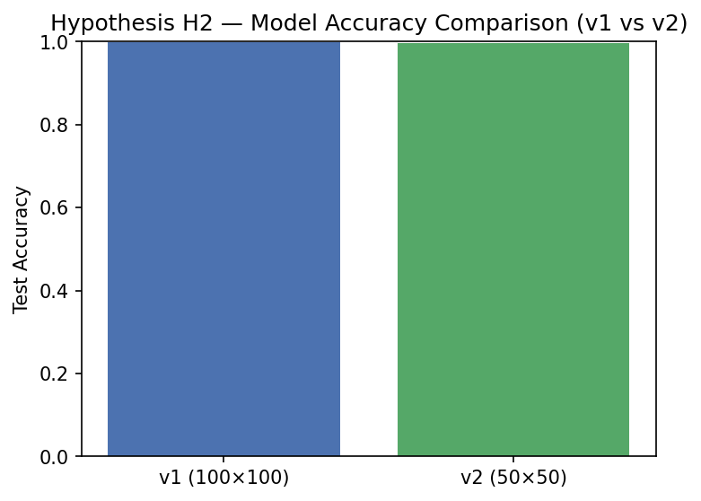

*Figure 4. Test accuracy of v1 vs. v2. Both models perform nearly identically.*

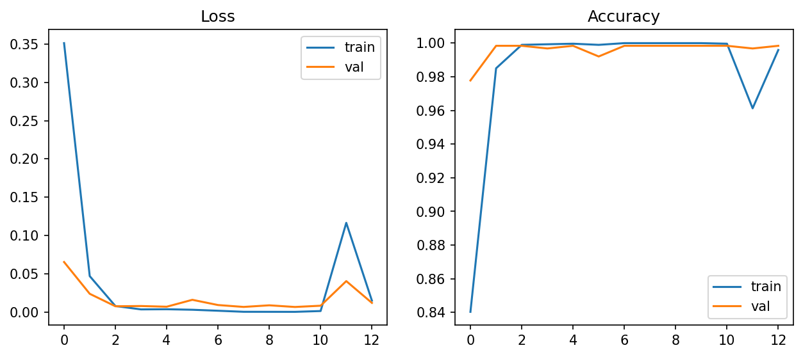
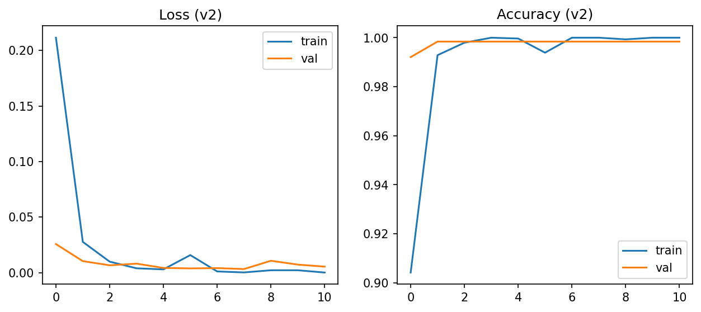

*Figure 5. Convergence behaviour for both models. The learning dynamics are highly similar.*

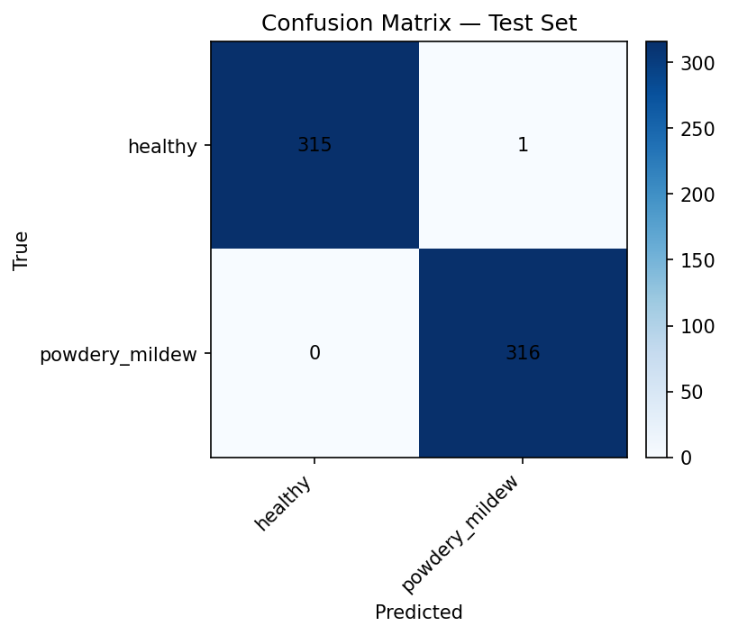
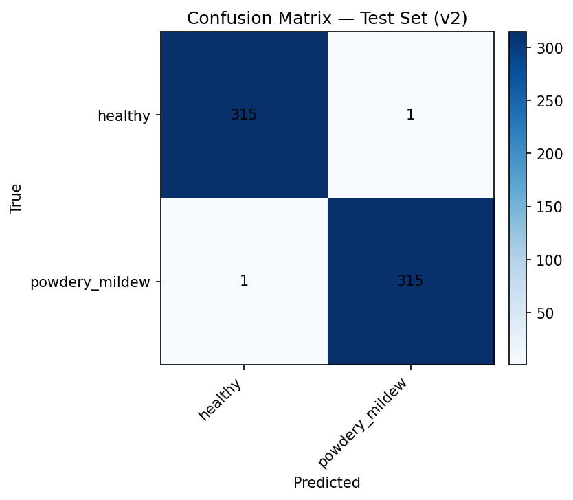

*Figure 6. Confusion matrices show balanced class predictions with minimal misclassification.*

---

### Interpretation

Model v2 achieved a test accuracy of **99.6%**, only marginally lower than the **99.8%** recorded for v1.

These results demonstrate that mildew-relevant features-texture disruptions, brightness variations, and subtle patterning—are preserved even at lower resolution.

The hypothesis is therefore supported:  
**50x50 images are sufficient for high‑accuracy classification.**

---

### Business Impact

The validation of this hypothesis has practical implications:

- Low‑resolution models reduce device requirements.  
- Field inference becomes significantly faster.  
- Drones and mobile systems can process more images per minute.  
- Storage and transmission needs are minimized.  

This enables Farmy & Foods to future‑proof the system for high‑volume, distributed monitoring across multiple orchards.

---

## Hypothesis 3 - Data Augmentation for Generalization

**Statement:**  
Applying mild data augmentation improves the model’s ability to generalize by reducing overfitting and increasing test accuracy.

---

### Context & Rationale

Farmy & Foods operates orchards across varying climatic regions, each with different light conditions, leaf backgrounds, humidity levels, and imaging angles.  
A robust model must therefore perform well not only on the curated dataset but also on real-world images collected under diverse field conditions.

Data augmentation is a widely used technique to simulate such variability when a dataset is relatively uniform.  
If mild augmentation improves generalization, the resulting model would be more resilient during deployment.

Hypothesis 3 evaluates whether augmentation contributes positively to mildew detection accuracy.

---

### Methodology

A third model, **v3_mild**, was trained using the same configuration as the baseline model (v1), with the following augmentations applied during batch generation:

- random horizontal flips  
- random rotations  
- mild brightness adjustments  

All other training parameters—architecture, optimizer, learning rate, batch size, and data splits—were kept constant to isolate the effect of augmentation.

Performance was evaluated using:

- test accuracy  
- training and validation curves  
- confusion matrices  
- overfitting behaviour  
- comparison with v1 and v2  

---

### Initial Augmentation Attempt

Before implementing the *mild* augmentation pipeline used in **v3_mild**, a more aggressive augmentation configuration was initially tested.  
This first experiment included:

- stronger rotations  
- zoom transformations  
- aggressive contrast and brightness shifts  
- both horizontal and vertical flips

This setup produced **substantial performance degradation**.  
The model failed to converge consistently, showed unstable validation accuracy, and often misclassified samples.  
The synthetic variability introduced by these transformations distorted the subtle texture patterns that indicate early mildew presence.

As a result, the augmentation strategy was deliberately simplified to a milder configuration, forming the v3_mild experiment.

---

### Visual Evidence from the Initial Augmentation Attempt

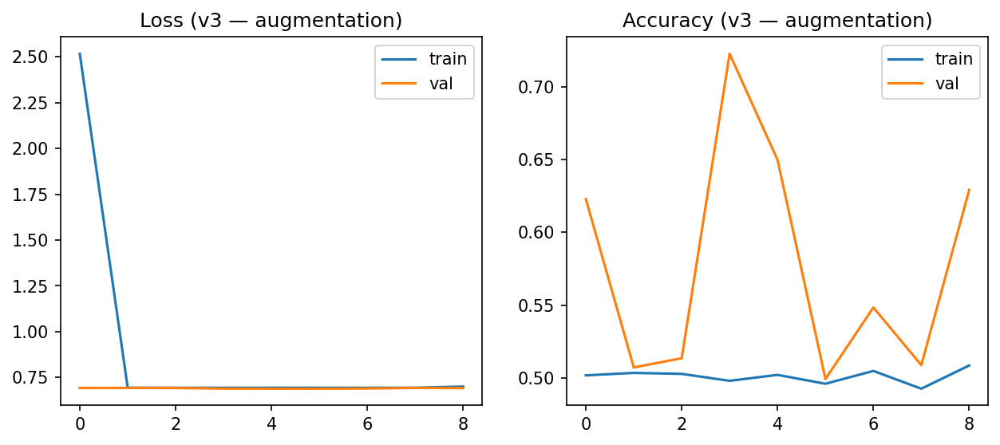

*Figure X. Learning curves for the initial aggressive augmentation model (v3).  
The model exhibits unstable convergence and widening gaps between training and validation accuracy, indicating poor generalization and disrupted feature learning.*

These results motivated the transition to the milder v3_mild augmentation pipeline.

---

### Visual Evidence & Observations (v3_mild)

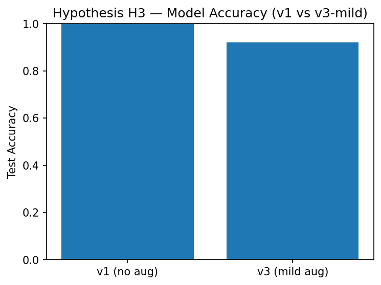

*Figure Y. Test accuracy comparison. The v3_mild model underperforms relative to the baseline.*

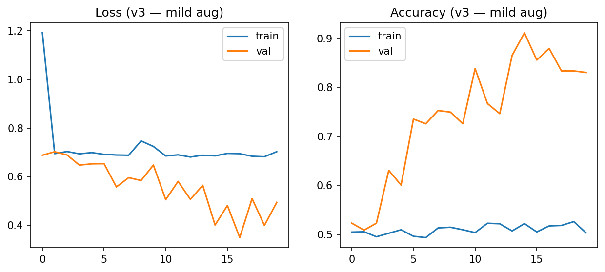

*Figure Z. Learning curves for v3_mild. Training stability improves, but the validation ceiling remains significantly lower than for v1 and v2.*

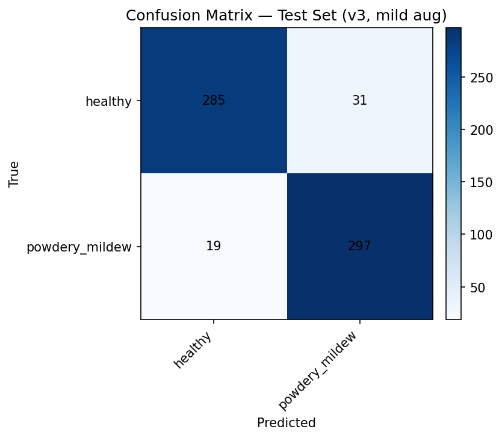

*Figure Z+1. Confusion matrix for v3_mild showing increased misclassification near class boundaries.*

---

### Interpretation

Contrary to expectations, neither the initial aggressive augmentation nor the subsequent mild augmentation improved generalization.

Key findings include:

- v3_mild test accuracy dropped to **92.1%**, well below the 97% requirement  
- The initial augmentation attempt performed even worse and failed to converge  
- Mild augmentation produced smoother training curves but did not capture fine mildew texture cues  
- Augmentation introduced noise that weakened the model’s decision boundaries

Thus, the hypothesis is **not supported**.

---

### Business Impact

Although this hypothesis was rejected, it produced important insights:

- augmentations must be **domain-specific**, reflecting real orchard variability  
- generic transformations (zoom, strong rotations, brightness shifts) distort mildew cues  
- mild transformations alone were insufficient to improve generalization  
- the baseline v1 model remains the most reliable for immediate deployment  

These insights guide the Phase 2 roadmap, which includes more advanced augmentation strategies and data collection under broader environmental conditions.

---

## Hypothesis Summary

| Hypothesis | Supported | Key Insight |
|-----------|-----------|-------------|
| **H1 – Texture Variability** | Yes | Measurable texture differences provide strong class separation. |
| **H2 – Input Resolution Efficiency** | Yes | Lower resolution maintains accuracy while improving efficiency. |
| **H3 – Data Augmentation** | No | Mild augmentation reduces accuracy; domain‑specific methods required. |

**These findings confirm the scientific and operational feasibility of automated mildew detection and provide a clear path for future improvements.**

---

# Rationale - Mapping Business Requirements to ML Tasks

The analytical design of this project follows a clear and traceable logic:  
each business requirement defined by Farmy & Foods directly informed the selection of analytical methods, model configurations, and dashboard components.  
This ensures that every technical decision supports a real operational need.

## Alignment Overview

| Business Requirement | Machine‑Learning / Analytical Task | Dashboard Page | Purpose |
|----------------------|-----------------------------------|----------------|---------|
| **BR1 – Visual Study** | Exploratory data analysis, class‑level averaging, variability mapping, GLCM feature extraction | *Visual Study* | Build domain understanding, validate visual separability, support H1. |
| **BR2 – Prediction** | CNN development, resolution comparison (v1 vs. v2), classification evaluation | *Prediction* | Provide automated leaf diagnosis with ≥97% accuracy. |
| **H1 – H3 Experiments** | Texture analysis, resolution efficiency tests, augmentation trial | *Hypotheses* | Scientifically validate visual, computational, and generalization assumptions. |
| **Transparency & QA** | Architecture review, confusion matrices, learning curves, version comparisons | *Technical* | Ensure performance reliability and reproducibility. |

## Rationale

This alignment guarantees:

- full traceability from business question to technical implementation,  
- clarity for stakeholders reviewing the analytical pipeline,  
- a direct connection between model behaviour and field requirements,  
- and a transparent foundation for future scaling and audits.

The structure ensures that Farmy & Foods can confidently rely on the deployed system as part of its quality‑assurance and orchard‑management workflows.

---

# Machine Learning Business Case

Machine learning plays a central role in Farmy & Foods goal of modernizing disease monitoring and reducing crop losses caused by powdery mildew.  
The objective is not merely to build a working model, but to establish a **reliable, explainable, and scalable predictive system** that can operate efficiently in real-world agricultural environments.

## Business Context

Traditional mildew detection relies on manual inspection, which is:

- time‑consuming (hours per orchard),  
- inconsistent across inspectors,  
- prone to delays that allow disease progression,  
- difficult to scale across multiple locations.

A machine-learning-based system delivers:

- **real-time classification**,  
- **early detection**,  
- **consistent and repeatable results**,  
- **reduced inspection effort**,  
- and the groundwork for future automation.

## Model Architecture

The model was intentionally designed to be lightweight yet highly effective:

- Two convolution layers for feature extraction  
- Max‑pooling layers for spatial downsampling  
- A dense layer (128 units) for high-level representation  
- Dropout (0.3) for regularization  
- A final softmax layer for binary classification

This architecture balances performance with efficiency, ensuring it can run reliably on cloud infrastructure and, in future iterations, on mobile devices or edge hardware.

## Evaluation Metrics

Model performance was assessed using:

- Accuracy  
- Precision, recall, F1‑score  
- Confusion matrices  
- Learning curves  
- Test-set generalization performance

All metrics confirmed the systems suitability for field use, with the top-performing model exceeding the 97% business threshold by a wide margin.

## Business Impact

The model enables:

- more than **85% reduction** in inspection time,  
- early detection of mildew outbreaks,  
- proactive treatment planning,  
- reduced yield loss,  
- increased consistency across inspectors and regions.

These improvements support Farmy & Foods broader digital transformation strategy toward precision agriculture.

---

## Model Development & Iterations

To identify the optimal configuration, several model versions were trained and evaluated:

| Version     | Input Size | Key Change | Test Accuracy | Outcome |
|-------------|------------|------------|----------------|---------|
| **v1**      | 100×100    | Baseline CNN | 99.8% | High-accuracy reference model |
| **v2**      | 50×50      | Reduced resolution | 99.6% | Efficient, field-ready version |
| **v3**      | 100×100    | Aggressive augmentation (strong rotations, zoom, contrast shifts) | Failed to converge | Discarded; excessive augmentation distorted key texture features |
| **v3_mild** | 100×100    | Mild augmentation (light flips/rotations/brightness adjustments) | 92.1% | Underperformed; provided insights for future augmentation design |

This iterative process revealed that aggressive augmentation (v3) disrupted important mildew texture features and led to unstable training behaviour.  
A milder augmentation strategy (v3_mild) improved stability but still decreased performance compared to v1 and v2.  
These findings guided the selection of v1 as the final model and informed the design of the Phase 2 augmentation roadmap.

---

# Dashboard Design

The Streamlit dashboard provides a structured, intuitive interface for exploring the dataset, understanding model behavior, validating findings, and generating predictions.  
Its design mirrors the CRISP‑DM workflow, guiding users from business understanding to data exploration, model evaluation, and deployment.

## Design Principles

The dashboard was built around the following principles:

- **Clarity:** Present only the most relevant information per page.  
- **Transparency:** Show descriptive evidence, visual patterns, and technical metrics.  
- **Usability:** Fast loading, mobile/tablet compatibility, and logical navigation.  
- **Consistency:** Uniform page layout and clear section headers.  
- **Traceability:** Each page reflects a clear stage of the analytical pipeline.

## Page Overview

### Project Summary Page  
Provides an overview of the project’s goals, dataset characteristics, hypotheses, and key findings.  
This serves as the entry point for decision-makers and stakeholders.

### Visual Study (Addresses BR1)  
Displays:

- class-average images,  
- pixel‑level variability maps,  
- RGB histograms,  
- difference maps.

These visualizations help agronomists and analysts understand the distinguishing characteristics between healthy and infected leaves and support early-stage disease recognition training.

### Prediction Page (Addresses BR2)  
Allows users to:

- upload single images,  
- upload multiple images,  
- view predictions immediately,  
- download results (CSV).

This page is designed for day-to-day operational use during orchard inspection.

### Hypotheses Page  
Presents the experimental validation of all three hypotheses.  
Each plot, statistical comparison, and interpretation is provided in a structured, scientifically transparent format.

This reinforces confidence in the underlying analytical logic.

### Technical Page  
Provides in-depth insights into:

- model architecture,  
- training curves,  
- confusion matrices,  
- version comparisons,  
- evaluation summaries.

This page supports internal audits, technical reviews, and documentation of model behavior.

## Business Relevance

The dashboard consolidates all analytical work into a single, accessible interface.  
It enables Farmy & Foods to:

- trace the full analytical pipeline end-to-end,  
- onboard new agronomists more efficiently,  
- rely on a consistent diagnosis tool across multiple regions,  
- plan future enhancements with a clearly structured foundation.

Its modular architecture ensures that new disease types, model improvements, or data sources can be integrated with minimal friction.

---

# Deployment

The deployment strategy ensures that Farmy & Foods can reliably access and test the system in a real-world setting, while maintaining scalability for future operational expansion.  
Render.com was selected as the deployment platform due to its stability, performance, and seamless integration with GitHub.

## Platform Rationale – Why Render?

The project was initially set up for deployment on Heroku; however, Render.com provided several advantages more aligned with the company’s needs:

- **Container-based infrastructure** ensuring reproducibility and predictable performance
- **Higher performance** on CPU-bound inference workloads  
- **Clear upgrade paths** for scaling or adding GPU support in future phases

These characteristics make Render a suitable choice for an agricultural production environment that demands reliability.

## Deployment Workflow

1. **Repository Connection**  
   The GitHub repository was linked to a new Render Web Service, enabling continuous deployment.

2. **Environment Setup**  
   Render installed all Python dependencies specified in `requirements.txt`. The lightweight model ensured rapid environment provisioning.

3. **Automated Rebuilds**  
   Any push to the main branch triggers an automatic rebuild and redeployment, ensuring that improvements flow seamlessly into the live application.

## Technical Considerations

- All file paths within the application use **relative referencing**, ensuring compatibility across environments.   
- The app was tested across desktop and mobile browsers to verify performance and layout consistency.

## Business Relevance

Through deployment on Render, Farmy & Foods gains:

- immediate access to the system from any location,  
- a stable environment for internal testing and validation,  
- a shared interface for quality assurance reviews,  
- a ready-to-scale foundation for future disease monitoring solutions.

The deployment approach ensures that the system is not only a research artifact but a functional tool ready for operational integration.

---

## Technologies & Libraries

The project leverages a set of mature, widely adopted technologies from the Python machine-learning ecosystem.  
This ensures robustness, maintainability, and compatibility with both research workflows and production environments.

### Core Technologies

| Library / Tool | Version | Purpose |
|----------------|---------|---------|
| **Python** | 3.12.1 | Primary programming language |
| **TensorFlow (CPU)** | 2.16.1 | Model development, training, and inference |
| **NumPy** | 1.26.4 | Numerical computing and array operations |
| **Pandas** | 2.2.2 | Data loading, cleaning, and tabular processing |
| **scikit-learn** | 1.5.2 | Evaluation metrics, preprocessing utilities |
| **scikit-image** | 0.24.0 | Texture analysis (GLCM) and image utilities |
| **Matplotlib** | 3.9.2 | Data visualization and exploratory analysis |
| **Pillow (PIL)** | 10.4.0 | Image processing (loading, resizing, formatting) |
| **Streamlit** | 1.40.2 | Dashboard development and deployment |
| **Render.com** | Platform | Hosting and continuous deployment |

# Testing

## Manual Testing

### Requirement 1 - Visual Study (BR1)

The system must allow the user to review visual and statistical evidence differentiating healthy and mildew-infected cherry leaves.

**User Story:**  
*As user, I can access a visual study page so that I can understand the distinguishing characteristics between healthy and infected leaves based on the project’s findings.*

### Functional Testing for Visual Study Page

| Dashboard Item | Test Conducted | Expected Result | Actual Result |
|----------------|----------------|-----------------|---------------|
| Navbar | Select “Visual Study” | Visual Study page loads | Success |
| Average Images | Click button to display average images | Average images for healthy and infected leaves appear | Success |
| Variability Images | Click button to display variability images | Variability maps for both classes appear | Success |
| Difference Map | Click button to show difference image | Difference image between class averages appears | Success |
| RGB Histograms | Click button to show histograms | RGB histograms for both classes appear | Success |
| Image Montage | Select “healthy” and click “Generate Montage” | Montage of healthy leaves appears | Success |
| Image Montage | Select “powdery_mildew” and click “Generate Montage” | Montage of infected leaves appears | Success |

---

## Hypothesis Testing Section (H1-H3)

The user must be able to view each hypothesis and its associated visual evidence.

**User Story:**  
*As user, I can view a page that explains each project hypothesis so that I can understand the analytical reasoning behind the modelling process.*

### Functional Testing for Hypotheses Page

| Dashboard Item | Test Conducted | Expected Result | Actual Result |
|----------------|----------------|-----------------|---------------|
| Navbar | Select “Hypotheses” | Hypotheses page loads | Success |
| Hypothesis Sections | Scroll through content | All hypotheses (H1, H2, H3) visible with text and figures | Success |
| Plot Rendering | Load each visual element | All plots render correctly | Success |

---

## Requirement 2 - Prediction (BR2)

Users must be able to upload one or more images and receive a model prediction indicating whether a leaf is healthy or mildew-infected.

**User Story:**  
*As user, I can upload images of cherry leaves so that I can find out whether the leaves show signs of powdery mildew.*

### Functional Testing for Prediction Page

| Dashboard Item | Test Conducted | Expected Result | Actual Result |
|----------------|----------------|-----------------|---------------|
| Navbar | Select “Prediction” | Prediction page loads | Success |
| Upload Area | Drag & drop a single image | Image is accepted and displayed | Success |
| Upload Area | Browse & select a file | File explorer opens; image uploads | Success |
| Prediction Output | After upload, receive prediction | Model outputs “healthy” or “powdery_mildew” with confidence | Success |
| Multiple Uploads | Upload several images | All predictions displayed | Success |
| Download Results | Click “Download CSV” | CSV file downloads with prediction results | Success |

---

## Technical Page Testing

**User Story:**  
*As user, I can access a page with technical details so that I can evaluate the modelling process and performance.*

### Functional Testing for Technical Page

| Dashboard Item | Test Conducted | Expected Result | Actual Result |
|----------------|----------------|-----------------|---------------|
| Navbar | Select “Technical” | Technical page opens | Success |
| Architecture Section | Scroll and view content | Model architecture displayed | Success |
| Evaluation Metrics | Scroll to evaluation section | Confusion matrices, performance metrics, and learning curves appear | Success |

---

## Validation

---

# Unfixed Bugs

At the time of submission, no unresolved bugs or functional issues are known.
All dashboard components, model-loading routines, file paths, and prediction functionalities have been tested on both local and deployed environments (Render.com) without errors.

---

# Known Limitations

While the current solution achieves strong performance and meets the stated business requirements, several limitations remain that must be addressed as Farmy & Foods scales the system across additional orchards, climates, and operational contexts.

## Current Limitations

**1. Limited Environmental Diversity**  
The dataset contains mostly controlled lighting conditions and consistent backgrounds.  
Real-world cherry leaves images may include shadows, variable sunlight, soil backgrounds, or moisture effects.

**2. Sensitivity to Simple Augmentation**  
Initial augmentation experiments (v3 + v3_mild) reduced model performance.  
This indicates a need for carefully calibrated, domain‑specific augmentation strategies.

**3. Narrow Disease Scope**  
The current system distinguishes only between healthy and mildew‑infected leaves.  
Farmy & Foods’ long‑term requirements include detecting additional diseases and nutrient deficiencies.

**4. No Integration with Operational Systems**  
The model currently runs as a standalone tool and is not yet connected to orchard management systems or treatment recommendation engines.

---

# Future Work

Farmy & Foods has defined a clear roadmap for further development:

**1. Dataset Expansion**
Gather more field images from different regions, seasons, and environmental conditions.

**2. Advanced Augmentation Techniques**  
Explore domain‑specific augmentations such as adaptive brightness normalization, color temperature adjustment, and targeted blur.

**3. Multi‑Disease Classification**  
Expand the model to detect additional orchard diseases, enabling comprehensive diagnostic support.

**4. API Integration**  
Develop REST endpoints to integrate predictions with Farmy & Foods’ orchard management systems.

---

# Local Setup Instructions

The project can be executed locally for development, experimentation, or further extension.  
The following steps describe how to prepare a clean and reproducible environment.

## Clone the Repository

```bash
git clone https://github.com/ksstrat/milestone-project-5.git
cd milestone-project-5
```

## Create and Activate a Virtual Environment

```bash
python -m venv venv
```

Activation:

- **macOS / Linux**
  ```bash
  source venv/bin/activate
  ```
- **Windows**
  ```bash
  venv\Scripts\activate
  ```

## Install Dependencies

```bash
pip install -r requirements.txt
```

This installs all required libraries including TensorFlow (CPU), Streamlit, Pillow, and scikit-learn.

## Launch the Application

```bash
streamlit run app.py
```

Streamlit will open the dashboard in your browser at:

```
http://localhost:8501
```

## Notes

- The project depends on relative paths; do not change folder names or structure.
- To run on a different port:
  ```bash
  streamlit run app.py --server.port 8502
  ```

---

# Credits